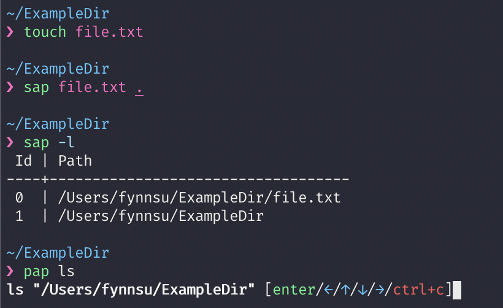
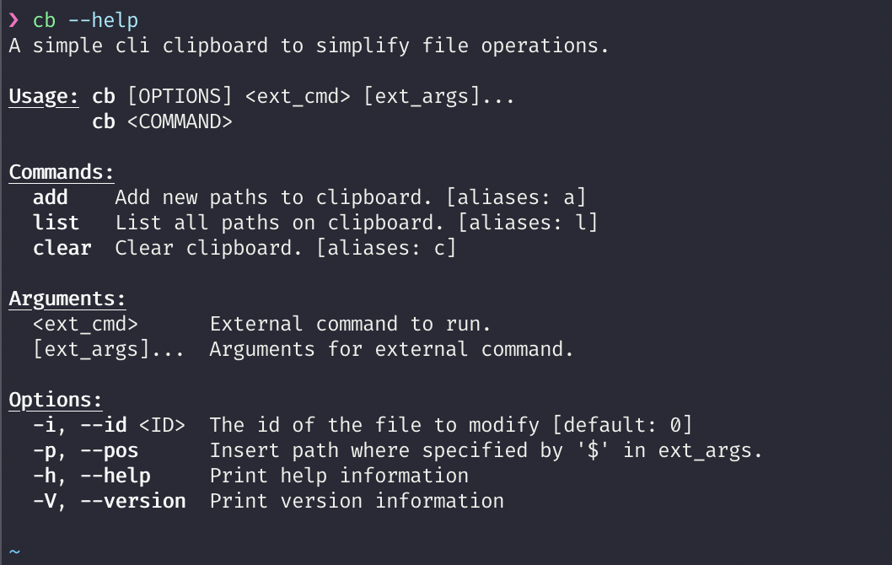

# SAvePath (sap) & PAstePath (pap)

A command-line tool for saving and pasting file/dir paths into cmds.



## Installation
Run:
```
cargo install --git https://github.com/FynnSu/clipboard
```
to install the executibles. To Use the pap command you need to add the following to your .bashrc/.zshrc:
```
eval "$(sap -a -s SHELL)"
```
where SHELL is the shell you are using (bash/zsh/fish).

## Usage
### Add a path to store

```
sap file.txt
```

### View saved paths:
```
sap -l
```
Output:
```
 Id | Path
----+-------------------------------
 0  | /PATH/TO/FILE/file.txt
 1  | /PATH/TO/OLDER/FILE/older.txt
```

### Use most recently added path in external command
Run any command (e.g. `ls`) and insert a saved path into the cmd
```
pap cp .
```
Response:
```
cp "/PATH/TO/FILE/file.txt" . [enter/←/↑/↓/→/ctrl+c]
```
Just press enter to confirm. The left and right arrow keys can be used to move where the path is inserted. The up and down arrow keys can be used to cycle through the saved paths. Pressing ctrl+c will cancel the command.

### Save Path Help Output



## Acknowledgements

The prompt formatting and mechanism is inspired by [thefuck](https://github.com/nvbn), a tool for correcting previous commands.